#  Exercise 1 - Generate an SAP Fiori app from business requirements

In this exercise, we will create an **SAP Cloud Application Programing** (CAP) project together with an SAP Fiori app using a floorplan provided by SAP Fiori elements for OData V4. The project will be automatically generated from a business requirements document that you will provide.

## Exercise 1.1 Launching the SAP Fiori tools AI Automated Generator

In the **SAP Business Application Studio**, the **projects** folder should be open from the last exercise.  Click on the **SAP Fiori** icon in the left hand side panel.


**Note:** If you cannot see the **SAP Fiori** icon, you may have to select the three dots and expand the menu to choose it:

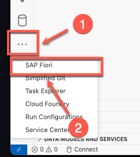

The **SAP Fiori** panel launch, you can close the **Application Modeler** and **Information** sections, and keep the **Automated Generator** section open

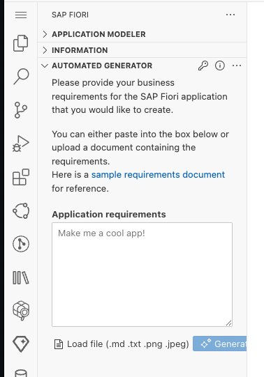

## Exercise 1.2 Providing a business requirements document to the Generator

The sample document below details a business requirement to build an application for creating and managing contracts and customers.

Click on the copy icon  to copy the text to the clipboard.


```
I want to create an SAP Fiori application that satisfies the requirements from the following user story:

Description

As a contract manager or administrator, I want to create and manage contracts and customer information in the system, 
so that I can effectively track and handle legal agreements and customer interactions.

Customer Description
Contract: A Contract involves defining a structured representation of a legal agreement or arrangement between two or more parties. 
Contracts can cover a wide range of agreements, such as sales contracts, service agreements, employment contracts, and more. 
Common attributes of a contract might include:
1. Contract ID: A unique identifier for the contract.
2. Customer: Information about the customer involved
3. Contract Type: The type of contract (e.g. sales, service, employment).
4. Start Date: The date on which the contract becomes valid.
5. End Date: The date on which the contract expires (if applicable).
6. Status: The current status of the contract (draft, active, expired, terminated, etc.)

Customer: A customer is an individual, organization, or entity that purchases goods, products, or services from another party, 
typically a business or seller. A typical customer has the following attributes:
1. Name
2. Identification Number
3. Address
4. Contact Information

Identification Number: A unique identification number for a customer is a distinct and non-repeating numerical value 
assigned to each customer record within a database or information system. This number serves as a primary key or identifier 
that uniquely distinguishes one customer from another.
Name: A "name" typically refers to the given name of a person or entity, or a label by which they are addressed or identified.
Address: An "address" typically refers to a physical location where an individual, business, or entity is situated 
or can be reached.

Acceptance Criteria

Scenario 1: List All Contracts
Given I am logged into the contract management system, when I launch the SAP Fiori application to maintain contracts, 
then I should be able to view the list of all the contracts in a list without pressing the GO button.
The list of all the contracts should have : Contract ID, Customer, Contract Type and Start Date
Next to this list, I would like to see the list of all customers.
The list of filters should include Contract Type, Contract Status and Start Date.

Scenario 2: View Contract Details
Given I am logged into the contract management system, when I select a specific contract from the list of SAP Fiori application, 
then I should be able to view the contract details.
The contract details will be:

Field Name       Tab in App       Section or Field Group
----------       ----------       ----------------------
ContractID       Contract Data    Contract Details
Customer Name    Contract Data    Contract Details
Contract Type    Contract Data    Contract Details
Status           Contract Data    Contract Details
Start Date       Contract Data    Contract Details
End Date         Contract Data    Contract Details
```

Paste the text from the clipboard into the **Application Requirements** text box. The **Generate** button should then become enabled

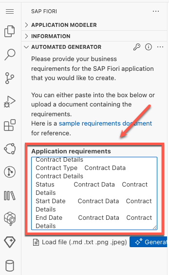

Click on the **Generate** button to start generating your application

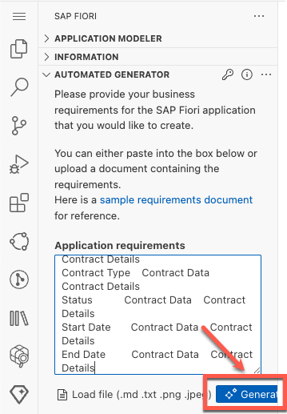

The application will start generating and go through each of the steps.  This can take some time.

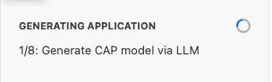


## Exercise 1.3 Reviewing the generated application

When generation of the application completes, the **staging area** will launch.  Click on a file in the staging area and it will load in the main window for you to review.

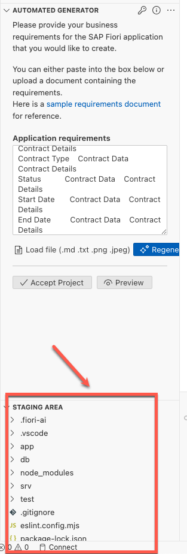

Click on the **Preview** button.  

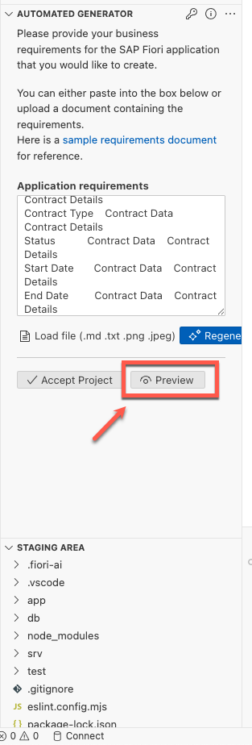

A new browser tab should launch with the generated application.  Click between **Customers** (1) and **Contracts** (2) to see the different data tables.

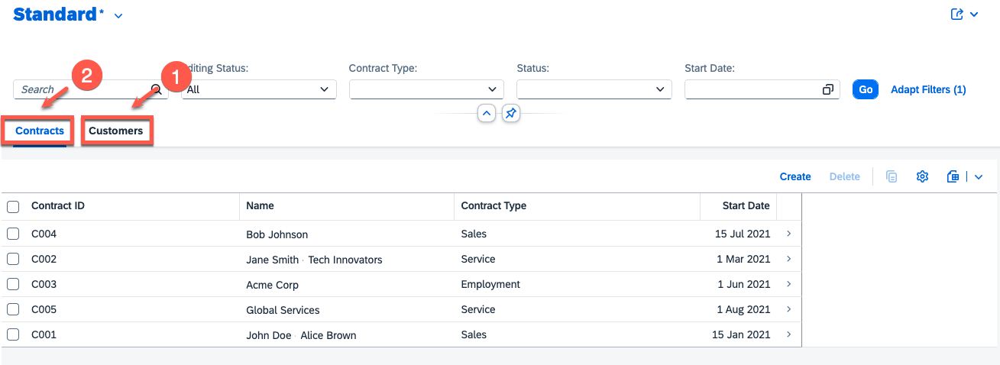

## Exercise 1.4 Accepting the generated application

In the SAP Fiori panel in SAP Business Application Studio, click **Accept** to accept the project into your workspace

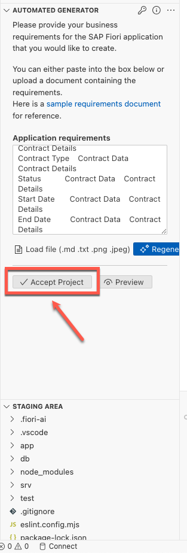

Click on the **Explorer** icon in the side panel and you will see that you now have a new **CAP project** with an **SAP Fiori** app. The project folder will be called **ai-created-app**.

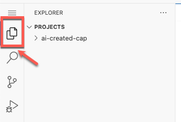

## Exercise 1.5 Providing your own business requirements for generation.

Open the **SAP Fiori** panel again

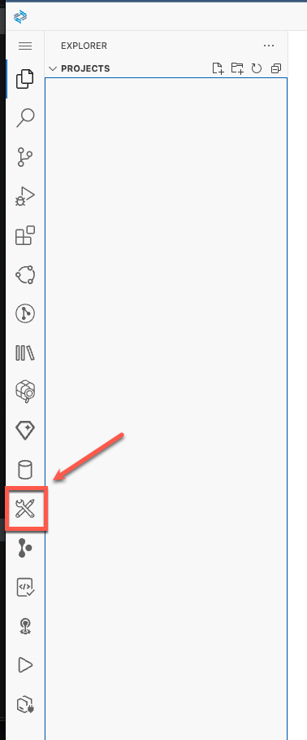

This time, use your imagination to provide a business requirement document from which you would like to create an SAP Fiori app.  

Some examples:

```
Create an app that lists the US presidents
```

```
Create an app that I can use for my pet grooming bookings
```

## Summary

You've now successfully generated a SAP Fiori app using business requirements as input to the AI generator.

Continue to - [Exercise 2 - Generate an SAP Fiori app from an image](../ex2/README.md)
