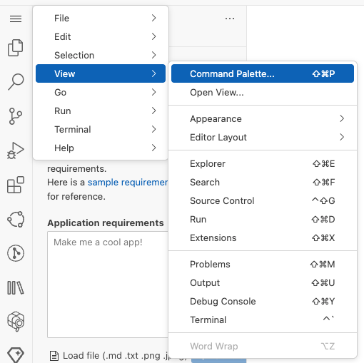
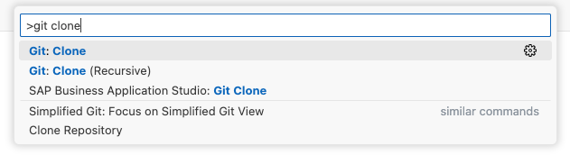
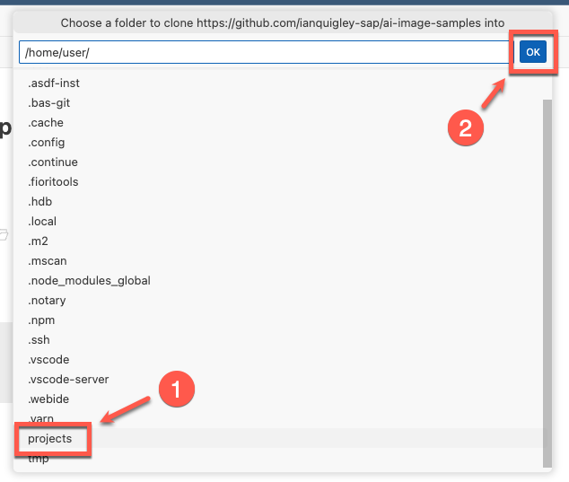
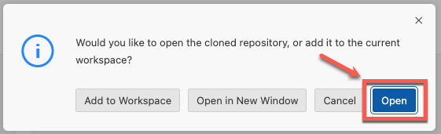
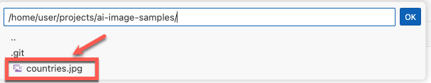
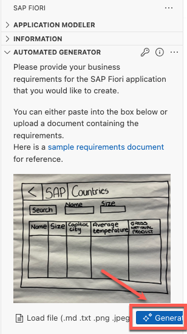
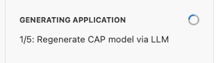
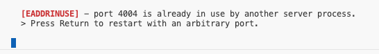
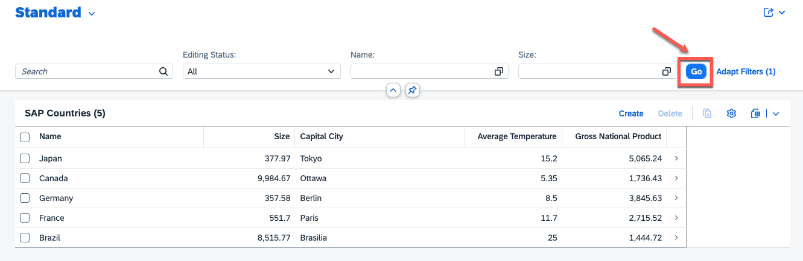
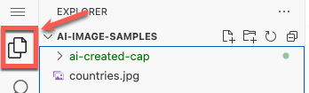

#  Exercise 2 - Generate an SAP Fiori elements application from an image

In this exercise, we will create a number of **SAP Fiori elements** applications, but instead of using a text document as input, we will instead use images of the applications that we want to create.

## Exercise 2.1 Downloading the sample images into SAP Business Application Studio

From the menu select **View -> Command Palette**



Sarch for command **git clone** and select it.



Paste the repository link below into the input field and hit enter.

```
https://github.com/ianquigley-sap/ai-image-samples
```

Choose the projects folder for the repository location and click **OK**



Click **Open** to open SAP Business Application Studio with the new repostiory




## Exercise 2.2 Launching the SAP Fiori tools AI Automated Generator with image input

Similar to exercise 1, ensure that the SAP Fiori tools panel is open with the AI Automated Generator displayed (you can close the **Application Modeler** and **Information** sections):


Click on the **Load file** link


Select the **countries.jpg** file and click **OK**



A thumbnail of the image should appear in the input box.  Click **Generate** to start generate the application directly from the image.



The application will start generating, give it some time



## Exercise 2.3 Previewing the generated application

After generation, click on the **Preview** button to launch a preview of the generated application.  


You may see a message in the terminal stating that the port is already in use (from previewing our application from exercise 1), click **Return** to use any other port for preview



The application should launch in a new browser tab. Click **Go** to see the sample data that the AI has created.



Navigate back to the tab with SAP Business Application Studio, and click **Accept** to include this project into your workspace


Click on the **Explorer** icon and you should have a new folder for the project entitled **ai-generated-cap**



## Summary

You've now successfully generated a SAP Fiori elements application using an sketch of the application you'd like to generate

Continue to - [Exercise 3 - Generate an SAP Fiori elements application using images and text](../ex3/README.md)
