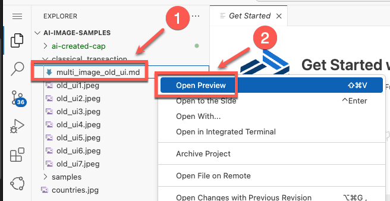
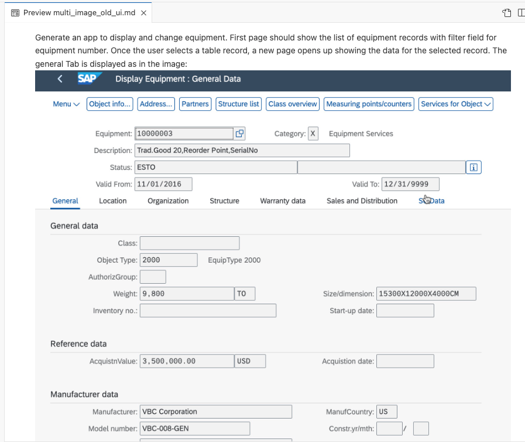
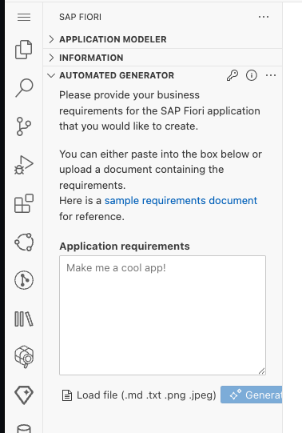
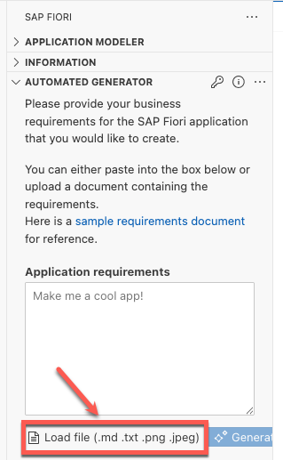
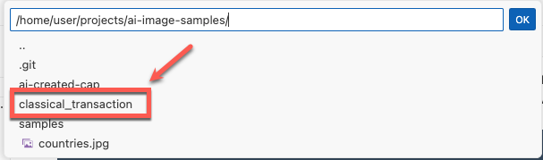
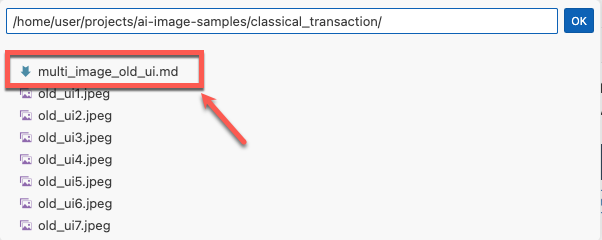
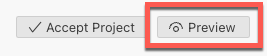
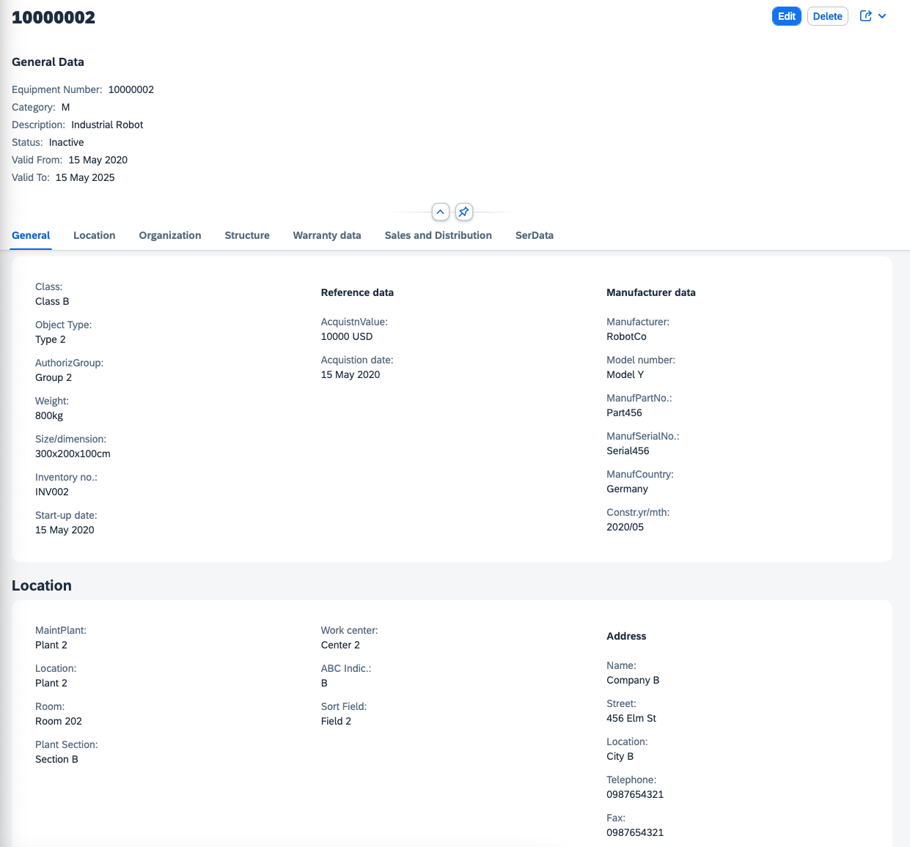
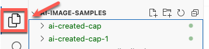

#  Exercise 3 - Generate an SAP Fiori elements application using images and text

In this exercise, we will create an **SAP Fiori elements** application using a document that contains both text and images, so that the required application can be best described.

## Exercise 3.1 Uploading the business requirement document with images

In the explorer in SAP Business Application Studio, expand the **transport-request-distribution** folder and right click on the **requirement0.md** file (1).  Then click on the **Open Preview** link (2).

You should then see a document that includes a mixture of text and images.  This document contains images from a classic transaction app and details what each of the sections in the object page should contain with a mixture of screenshots and text.

Similar to the previous exercises, click on the SAP Fiori tools icon to open the panel with the AI Automated Generator displayed (you can close the **Application Modeler** and **Information** sections):

Click on the **Load file** link

Click into the **transport-request-distribution** folder

Select the **requirement0.md** file

The text of the file will be populated into the text box.  Click **Generate** to start generating your application.  This will take some time.

## Exercise 3.2 Reviewing the generate application from a business requirement document with images

After generation completes, click on the **Preview** button to launch a preview of the generated application.  

You may see a message in the terminal stating that the port is already in use (from previewing our application from exercise 1), click **Return** to use any other port for preview

A new browser tab should open with the generated application.  Click on the **Go** button to display the items

Select an item from the list and the object page should display with the details:

Navigate back to the tab with SAP Business Application Studio, and click **Accept** to include this project into your workspace

Click on the **Explorer** icon and you should have another new folder for the project, this time entitled **ai-generated-cap-1**

## Summary

In this exercise you have seen how the Fiori AI generator can use both text and images to create detailed **SAP Fiori elements** applications.

Continue to - [Exercise 4 - Other sample images for Generation](../ex4/README.md)
