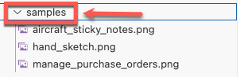
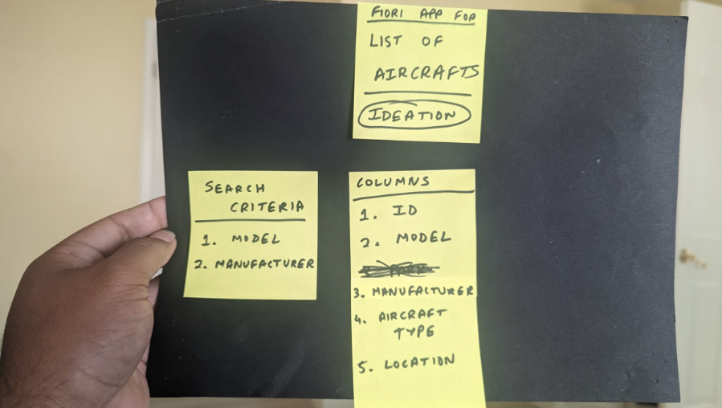

#  Exercise 4 - Other sample images for generation

In this exercise, we will describe how the Fiori tool AI Generator can inspect other forms of image, from notes on a whiteboard to sticky notes, and it will try its best to generate the correct **SAP Fiori elements** application.

## Exercise 4.1 Using the other sample images

Expand the **samples** folder and you should see 3 images available to you.  Click on an image to examine the contents.

**aircraft_sticky_notes.png**

This image demonstrates how the Fiori tools AI is able to determine from a list of sticky notes, what kind of application is required.  It will analyse the text and try deliver the correct application from that.

