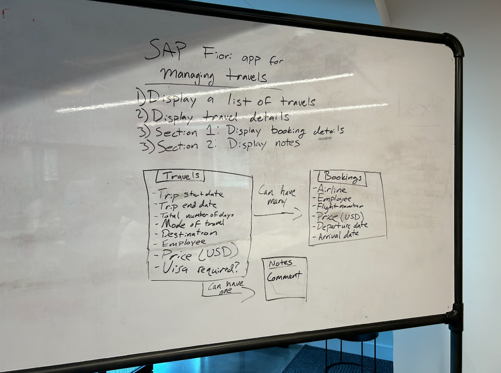
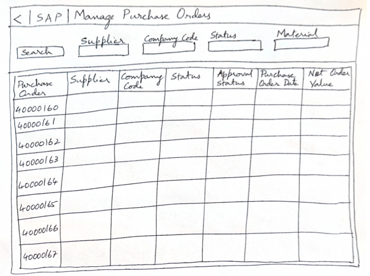

#  Exercise 4 - Other sample images for generation

In this exercise, we will describe how the Fiori tool AI Generator can inspect other forms of image, from notes on a whiteboard to sticky notes, and it will try its best to generate the correct **SAP Fiori elements** application.

## Exercise 4.1 Using the other sample images

Expand the **samples** folder and you should see 3 images available to you.  Click on an image to examine the contents.  Take one of these images and upload to the SAP Fiori tools Automated Generator and preview what is developed.

- **aircraft_sticky_notes.png**

This image demonstrates how the Fiori tools AI is able to determine from a list of sticky notes, what kind of application is required.  It will analyse the text and try deliver the correct application from that.

- **hand_sketch.png**

This image shows how the Fiori tools AI can interpret the ideas from a brain storming session and determine the best application that should be developed.

- **manage_purchase_orders.png**

This image represents a handwritten sketch with somewhat messy handwriting.  The Fiori tools AI should still be able to analyse this image and detect the relevant columns and filters for the generated application

## Exercise 4.2 Use your own images/sketches

Now it's your turn! On a piece of paper, sketch out the application you would like to generate.  Try and ensure that it represents a tabular list of items, as that best fits the supported SAP Fiori elements templates.  Take a photo and then upload it to your PC.  From there, you can drag it into the folder in SAP Business Application Studio and generate an application from it.

## Summary

You've now successfully completed the hands-on workshop. Congratulations!
